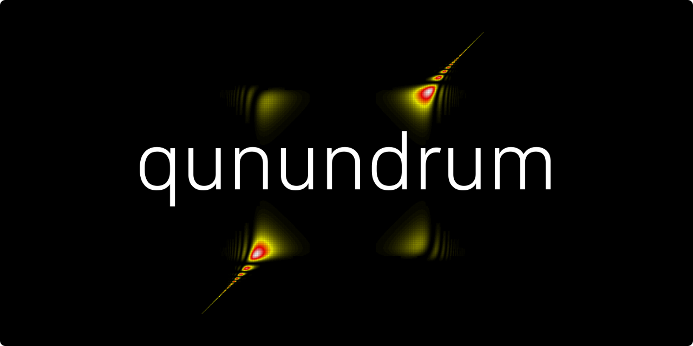
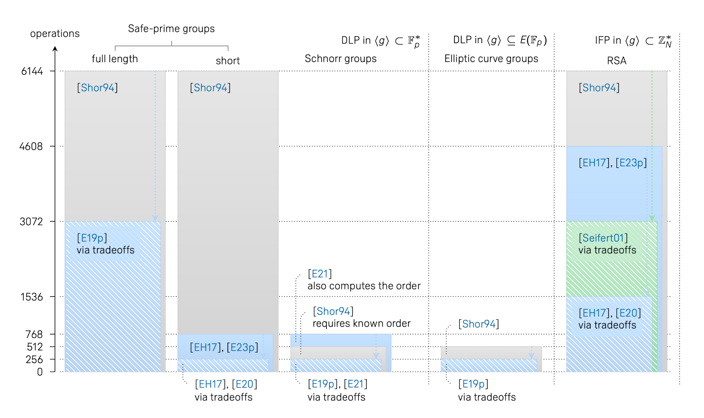

<a href="README.md"></a>

# Qunundrum
This repository contains the source code of MPI programs for computing the probability distributions induced by:

* Shor's order-finding algorithm [[Shor94]](https://doi.org/10.1109/SFCS.1994.365700) [[Shor97]](https://doi.org/10.1137/S0097539795293172)
* Seifert's order-finding algorithm with tradeoffs [[Seifert01]](https://doi.org/10.1007/3-540-45353-9_24)
* Ekerå–Håstad's algorithm for computing short discrete logarithms with tradeoffs [[EH17]](https://doi.org/10.1007/978-3-319-59879-6_20) [(Slides)](https://2017.pqcrypto.org/conference/slides/quantum/ekera-hastad-complex.pdf) [[E20]](https://doi.org/10.1007/s10623-020-00783-2)
* Ekerå–Håstad's algorithm for factoring RSA integers with tradeoffs [[EH17]](https://doi.org/10.1007/978-3-319-59879-6_20) [(Slides)](https://2017.pqcrypto.org/conference/slides/quantum/ekera-hastad-complex.pdf) [[E20]](https://doi.org/10.1007/s10623-020-00783-2)
* Ekerå's algorithm for computing general discrete logarithms and orders with tradeoffs [[E21]](https://doi.org/10.1515/jmc-2020-0006)
* Shor's algorithm for computing general discrete logarithms [[Shor94]](https://doi.org/10.1109/SFCS.1994.365700) [[Shor97]](https://doi.org/10.1137/S0097539795293172) with modifications [[E19p]](https://arxiv.org/pdf/1905.09084.pdf)

Once computed the distributions may be sampled to simulate the quantum algorithms. This is possible for large cryptographically relevant problem instances. Note however that the solution to the problem (i.e. the group order, the discrete logarithm, or in some cases both) must be known.

This repository furthermore contains the source code of MPI programs that estimate the number of vectors that need to be enumerated in the classical lattice-based post-processing algorithms of Ekerå and Ekerå–Håstad, and of MPI programs that execute the post-processing algorithms with respect to simulated outputs from the quantum algorithms. For completeness, implementations of Shor's original post-processing algorithms are also provided. See also [[E21b]](https://doi.org/10.1007/s11128-021-03069-1) and [this repository](https://github.com/ekera/factoritall) for resources on efficiently factoring any integer after a single call to an order-finding algorithm.

### Algorithm comparisons
In the below diagram, the above algorithms are compared with respect to the number of group operations that they perform quantumly in each run, when solving cryptographically relevant problems.

All problem instances considered in the diagram have approximately a 128 bit classical strength level. The cost model is from [[FIPS 140-2 IG]](https://csrc.nist.gov/csrc/media/projects/cryptographic-module-validation-program/documents/fips140-2/fips1402ig.pdf). The solid bars illustrate the number of group operations required for algorithms not making tradeoffs. A single run is in general sufficient for these algorithms. The hatched bars illustrate the number of group operations required for algorithms making tradeoffs in the limit as the number of runs tends to infinity. In practice, the number of operations required is slightly higher. It is necessary to run these algorithms multiple times to achieve the tradeoff. The more runs one accepts to make, the better the achievable tradeoff.

Note that the quantum circuit required to implement the group operation for elliptic curve groups differs significantly from the circuit required for the other groups. This must be accounted for when making comparisons.



### Remarks
Note that the source code in this repository was developed for academic research purposes. It grew out of our research project in an organic manner as research questions were posed and answered. It is distributed "as is" without warranty of any kind, either expressed or implied. For further details on the terms of use, see the [license](LICENSE.md).

It is possible to further optimize portions of the code. However, the current code performs sufficiently well for our purposes. Note furthermore that the portions of the code that pertain to Shor's original algorithm for computing general discrete logarithms are based on a heuristic that lacks an error bound. These portions, and the heuristic, are currently a work in progress.

## Installing and compiling
To compile and run these programs under e.g. [Ubuntu 20.04 LTS](https://releases.ubuntu.com/releases/20.04), first execute:

```console
$ sudo apt install libgmp-dev libmpfr-dev libfplll-dev libopenmpi-dev
$ sudo apt install gcc g++ make openmpi-bin
```

This installs libraries and header files for [GMP](https://gmplib.org), [MPFR](https://www.mpfr.org) and [fpLLL](https://github.com/fplll/fplll), as well as libraries, headers and binaries for [OpenMPI](https://www.open-mpi.org) and for compiling C and C++ sources. You may then proceed to compile the executables:
```console
$ make
```

Under other Linux and Unix distributions, ensure that the tools contained in the aforementioned packages are installed and available in your search paths prior to running the above command. Under other operating systems, you may need to setup build scripts yourself.

### Building the documentation
To build the documentation using [Doxygen](http://www.doxygen.nl), first execute:

```console
$ sudo apt install doxygen graphviz
```

You may then proceed to build the documentation in HTML format from the source files:
```console
$ make documentation
```

## Quick examples
To generate the distribution induced by Ekerå–Håstad for a m = 256 bit short logarithm d = 2^m - 1 with s = 1, execute:

```console
$ mpirun ./generate_linear_distribution -max -d 256 1
```

The resulting distribution will be written to a file in the distributions directory. It will automatically be assigned a name according to the parameters used to generate it. You may now use this distribution to estimate the number of runs required to solve with a given bound on the volume quotient, and to verify this estimate by solving simulated output.

To instead generate a distribution for Shor's or Seifert's order-finding algorithms use the <code>-r</code> flag instead of the <code>-d</code> flag. The <code>-max</code> flag may be substituted for other flags to select the logarithm or order deterministically, explicitly, at random, and so forth. For further details, see the documentation for the [<code>generate_linear_distribution</code>](docs/pages/generate-linear-distribution.md) executable.

> <b>Note:</b> If you installed MPI under Ubuntu as described above, you must specify the number of processors using the <code>-np</code> flag whenever you invoke <code>mpirun</code>. At least two processors are required.

### Estimating the number of runs required to solve
To estimate the number of runs n required to solve with Ekerå–Håstad's lattice-based classical post-processing, execute:

```console
$ mpirun ./estimate_runs_linear_distribution \
     distributions/linear-distribution-max-dim-2048-d-m-256-s-1.txt
```

The executable will compute volume quotients for different n, and seek for the minimum n such that a bound on the volume quotient is respected. To solve without enumerating, the bound is two. This is the default. You may change the bound with the <code>-bound</code> flag. For further details, see the documentation for the [<code>estimate_runs_linear_distribution</code>](docs/pages/estimate-runs-linear-distribution.md) executable.

### Solving
To solve with Ekerå–Håstad's lattice-based classical post-processing after n = 2 quantum algorithm runs, execute:

```console
$ mpirun ./solve_linear_distribution \
     distributions/linear-distribution-max-dim-2048-d-m-256-s-1.txt 2
```

By default, the solver does not enumerate the lattice. To enable enumeration, add the <code>-enumerate</code> flag. Note that the enumeration itself is not parallelized. There is a <code>-timeout</code> flag that controls the timeout for enumeration operations. By default, the timeout is set to 5 minutes.

There are additional flags for selecting which lattice basis reduction to use. By default, the solver adaptively seeks to identify the smallest n such that the bound is respected. The search is aborted as soon as this n has been identified. There are also flags for disabling the adaptive search and early abort features.

For further details, see the documentation for the [<code>solve_linear_distribution</code>](docs/pages/solve-linear-distribution.md) executable. Note that there is also an executable that solves distributions for the order-finding problem with Shor's original continued-fractions based post-processing algorithm, see the [<code>solve_linear_distribution_shor</code>](docs/pages/solve-linear-distribution-shor.md) executable.

### Plotting
To plot the distribution, execute:

```console
$ ./plot_linear_distribution \
     distributions/linear-distribution-max-dim-2048-d-m-256-s-1.txt
```

The plot will be exported to a Latex source file to the <code>plots</code> directory. You may use <code>pdflatex</code> or some other version of Latex to convert this file into a PDF file for viewing. For further details, see the documentation for the [<code>plot_linear_distribution</code>](docs/pages/plot-linear-distribution.md) executable.

Note that the resolution of the distribution is automatically temporarily reduced before plotting it to avoid creating Latex source files of excessive size. This may affect the smoothness of the plot.

### Sampling
To sample the distribution, execute:

```console
$ ./sample_linear_distribution \
     distributions/linear-distribution-max-dim-2048-d-m-256-s-1.txt 10
```

This will print 10 samples for the distribution to standard output. For each sample, both an argument alpha_d sampled from the distribution, and a pair (j, k) sampled from the set of all pairs (j, k) with argument alpha_d, will be output. For further details, see the documentation for the [<code>sample_linear_distribution</code>](docs/pages/sample-linear-distribution.md) executable.

### Other executables
There are also executables for obtaining information on linear distributions, see the [<code>info_linear_distribution</code>](docs/pages/info-linear-distribution.md) executable, and for comparing such distribution, see the [<code>compare_linear_distributions</code>](docs/pages/compare-linear-distributions.md) executable.

### Two-dimensional probability distributions
Analogies for the above executables are available for generating two-dimensional probability distributions induced by the algorithm of Ekerå for computing general discrete logarithms. To use these executables, you basically remove the "linear" prefix from the executable names. The procedure is then essentially the same as described above, with some differences in the synopsis and in the behavior between the one- and two-dimensional executables.

For further details, please see the documentation for
- the [<code>generate_distribution</code>](docs/pages/generate-distribution.md) executable
- the [<code>filter_distribution</code>](docs/pages/filter-distribution.md) executable
- the [<code>estimate_runs_distribution</code>](docs/pages/estimate-runs-distribution.md) executable
- the [<code>solve_distribution</code>](docs/pages/solve-distribution.md) executable
- the [<code>plot_distribution</code>](docs/pages/plot-distribution.md) executable
- the [<code>sample_distribution</code>](docs/pages/sample-distribution.md) executable
- the [<code>info_distribution</code>](docs/pages/info-distribution.md) executable
- the [<code>compare_distributions</code>](docs/pages/compare-distributions.md) executable

### Diagonal probability distributions
Diagonal probability distributions are used to represent the probability distribution induced by Shor's original algorithm for computing general discrete logarithms when the group order is known. Analogies to the above executables that may be used to generate, sample and solve diagonal distributions are also available.

The generator and sampler are for the distribution that would be induced by Shor's original algorithm for computing general discrete logarithms, with the control register initialized to a uniform superposition over all register values, so as to enable control qubit recycling, and with a variable number of padding bits. The solver implements an improved version of Shor's original classical post-processing algorithm that performs a bounded search to increase the success probability. There is furthermore a lattice-based solver that supports tradeoffs.

The full modified quantum algorithm and the two post-processing algorithms are described in [[E19p]](https://arxiv.org/pdf/1905.09084.pdf). Note that the analysis in this paper is heuristic. The distribution is generated using this heuristic.

For further details, please see the documentation for
- the [<code>generate_diagonal_distribution</code>](docs/pages/generate-diagonal-distribution.md) executable
- the [<code>solve_diagonal_distribution</code>](docs/pages/solve-diagonal-distribution.md) executable
- the [<code>solve_diagonal_distribution_shor</code>](docs/pages/solve-diagonal-distribution-shor.md) executable
- the [<code>plot_diagonal_distribution</code>](docs/pages/plot-diagonal-distribution.md) executable
- the [<code>sample_diagonal_distribution</code>](docs/pages/sample-diagonal-distribution.md) executable
- the [<code>info_diagonal_distribution</code>](docs/pages/info-diagonal-distribution.md) executable
- the [<code>compare_diagonal_distributions</code>](docs/pages/compare-diagonal-distributions.md) executable

## About and acknowledgments
This source code was developed by [Martin Ekerå](mailto:ekera@kth.se), in part at [KTH, the Royal Institute of Technology](https://www.kth.se/en), in Stockholm, [Sweden](https://www.sweden.se). Valuable comments and advice were provided by Johan Håstad throughout the development process.

Funding and support for this work was provided by the Swedish NCSA that is a part of the [Swedish Armed Forces](https://www.mil.se).

Computations were performed on the [Beskow Cray XC40](https://www.pdc.kth.se/hpc-services/computing-systems/beskow) supercomputer and its pre- and post-processing cluster [Tegner](https://www.pdc.kth.se/hpc-services/computing-systems/tegner) at [PDC](https://www.pdc.kth.se) at [KTH](https://www.kth.se/en). Access was provided by the [Swedish National Infrastructure for Computing (SNIC)](https://www.snic.se). This version of the source code is intended to be run on generic Linux-based clusters.
