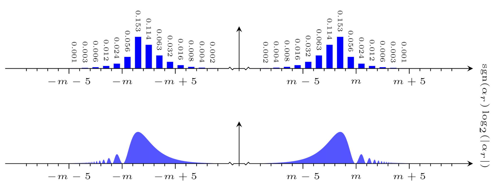

# The <code>plot_diagonal_distribution</code> executable

## Synopsis
```console
Synopsis: plot_diagonal_distribution \
   [ -sgn | -abs ] [ -eta-bound <eta-bound> ] \
      <distribution> { <distribution> }
```

Plots a diagonal distribution.

The plot is output to file in Latex format. It will be given an appropriate name and written to the <code>plots</code> directory. If this directory does not exist, it will be created. If the plot already exists, an error will be reported.

### Mandatory command line arguments
Arguments <code>\<distribution\></code> where
- <code>\<distribution\></code> is the path to the distribution

### Optional command line arguments
Flags specifying the plot appearance (defaults to <code>-sgn</code>):
- <code>-sgn</code> draw a plot in the signed logarithm of the argument
- <code>-abs</code> draw a plot in the absolute value of the logarithm of the argument

Flag specifying the bound $B_\eta$ (defaults to $B_\eta$ used to generate the distribution):
- <code>-eta-bound \<eta-bound\></code> sets $B_\eta$ to <code>\<eta-bound\></code>

   The bound $B_\eta$ controls how many peak indices $\eta$ are included when collapsing the distribution in $(\alpha_r, \eta)$ to a distribution in $\alpha_r$ prior to plotting: More specifically, the peaks with peak indices $\eta \in [-B_\eta, B_\eta] \cap \mathbb Z$ are included.

   If the bound $B_\eta$ is specified, it must be less than or equal to the corresponding bound specified when generating the diagonal distribution or an error will be signalled.

## Compiling the plot
To compile the source for the plot, you may use <code>pdflatex</code> as exemplified below:
```console
$ ./plot_diagonal_distribution distributions/diagonal-distribution-det-dim-2048-m-2048-sigma-10-s-30.txt
Importing the distribution from "distributions/diagonal-distribution-det-dim-2048-m-2048-sigma-10-s-30.txt"...
Writing the plot to "plots/plot-diagonal-distribution-m-2048-sigma-10-s-30.tex"...
Done.
$ cd plots
$ pdflatex plot-diagonal-distribution-m-2048-sigma-10-s-30.tex

(..)
```
You may of course also use other versions of Latex such as <code>xelatex</code>. Note that the Latex source requires Tikz.

### Interpreting the plot
The plot generated is in the signed logarithm of the argument $\alpha_r$:



Note that diagonal distributions store only a partial two-dimensional distribution in $(\alpha_r, \eta)$ computed using the expression for $f_\eta(\theta_r)$ given in [[E19p]](https://doi.org/10.48550/arXiv.1905.09084). The full distribution is computed on the fly by executables that sample the diagonal distribution.