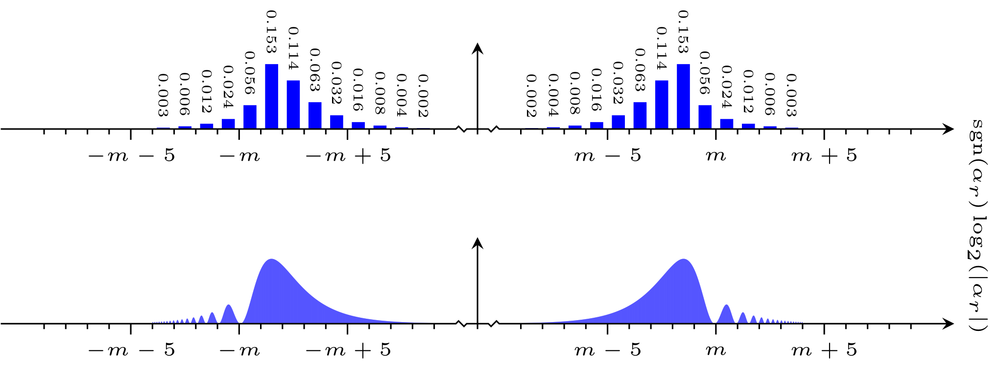

# The <code>plot_diagonal_distribution</code> executable

## Synopsis
```console
Synopsis: plot_diagonal_distribution [ -sgn | -abs ] <distribution> { <distribution> }
```

Plots a diagonal distribution.

The plot is output to file in Latex format. It will be given an appropriate name and written to the <code>plots</code> directory. If this directory does not exist, it will be created. If the plot already exists, an error will be reported.

### Mandatory command line arguments
Entries <code>\<distribution\></code> where
- <code>\<distribution\></code> is the path to the distribution

### Optional command line arguments
Flags specifying the plot appearance (defaults to <code>-sgn</code>):
- <code>-sgn</code> draw a plot in the signed logarithm of the argument
- <code>-abs</code> draw a plot in the absolute value of the logarithm of the argument

## Compiling the plot
To compile the source for the plot, you may use <code>pdflatex</code> as exemplified below:
```console
$ ./plot_diagonal_distribution distributions/diagonal-distribution-det-dim-2048-m-2048-sigma-5-s-1.txt
Importing the distribution from "distributions/diagonal-distribution-det-dim-2048-m-2048-sigma-5-s-1.txt"...
Writing the plot to "plots/plot-diagonal-distribution-m-2048-sigma-5-s-1.tex"...
Done.
$ cd plots
$ pdflatex plot-diagonal-distribution-m-2048-sigma-5-s-1.tex

(..)
```
You may of course also use other versions of Latex such as <code>xelatex</code>. Note that the Latex source requires Tikz.

### Interpreting the plot
The plot generated is in the signed logarithm of the argument alpha_r:



Note that diagonal distributions store a one-dimensional distribution in alpha_r using the expression for f(theta_r) given in [[E19]](https://arxiv.org/pdf/1905.09084.pdf). The distribution in phi = theta_d - d/r theta_r is computed on the fly using the expression for h(phi) given in [[E19]](https://arxiv.org/pdf/1905.09084.pdf) by the executables that use the distribution.