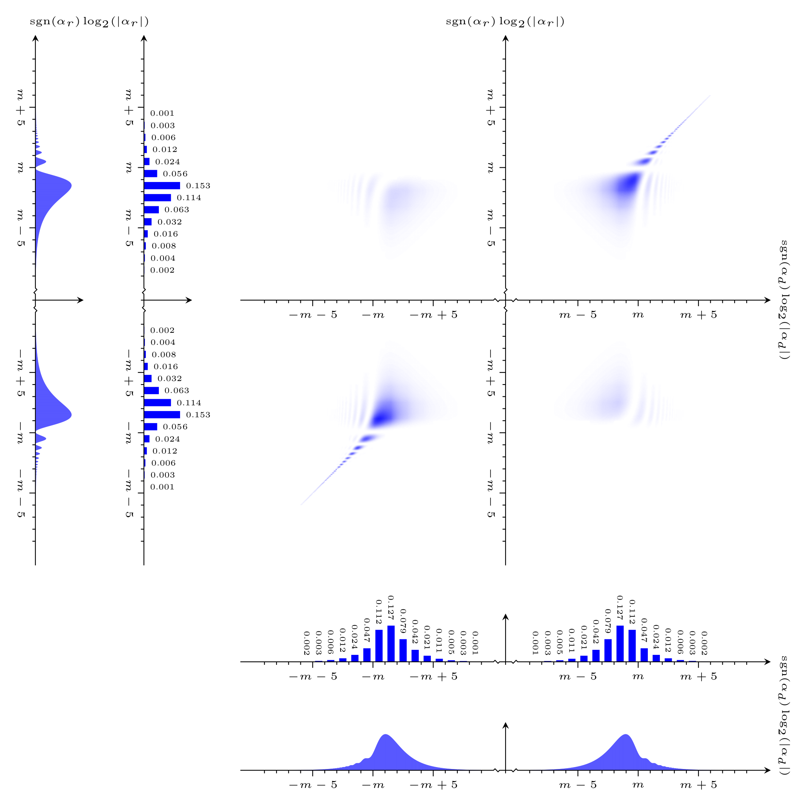

# The <code>plot_distribution</code> executable

## Synopsis
```console
Synopsis: plot_distribution <distribution> { <distribution> }
```

Plots a distribution. Note that the distribution resolution is automatically scaled down temporarily when plotting.

The plot is output to file in Latex format. It will be given an appropriate name and written to the <code>plots</code> directory. If this directory does not exist, it will be created. If the plot already exists, an error will be reported.

### Mandatory command line arguments
Arguments <code>\<distribution\></code> where
- <code>\<distribution\></code> is the path to the distribution

## Compiling the plot
To compile the source for the plot, you may use <code>pdflatex</code> as exemplified below:
```console
$ ./plot_distribution distributions/distribution-det-dim-heuristic-sigma-optimal-m-2048-s-30.txt
Importing the distribution from "distributions/distribution-det-dim-heuristic-sigma-optimal-m-2048-s-30.txt"...
Writing the plot to "plots/plot-distribution-m-2048-s-30.tex"...
Done.
$ cd plots
$ pdflatex plot-distribution-m-2048-s-30.tex

(..)
```
You may of course also use other versions of Latex such as <code>xelatex</code>. Note that the Latex source requires Tikz. Note furthermore that the source file is typically quite large for two-dimensional plots even though the resolution is scaled down automatically when plotting. You may therefore need to increase the amount of memory available to Latex. Another option is to use Lualatex which typically manages memory better. Note that if you use Lualatex, you may need to uncomment a line in the header of the Latex source file, see the comment in the source file for further details.

### Interpreting the plot
Executing the above procedure produces plots similar to the below plot:



The two-dimensional distribution is plotted in the signed logarithms of the arguments $(\alpha_d, \alpha_r)$. Collapsed marginal distributions in the signed logarithms of the arguments $\alpha_d$ and $\alpha_r$ are automatically plotted along the sides of the plotted two-dimensional distribution.
