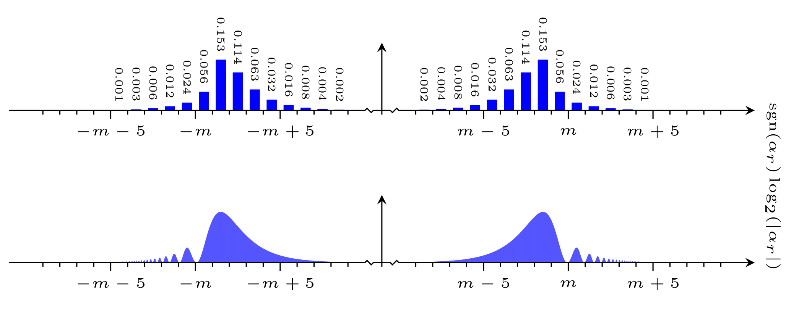

# The <code>plot_linear_distribution</code> executable

## Synopsis
```console
Synopsis: plot_linear_distribution [ -sgn | -abs ] <distribution> { <distribution> }
```

Plots a linear distribution.

The plot is output to file in Latex format. It will be given an appropriate name and written to the <code>plots</code> directory. If this directory does not exist, it will be created. If the plot already exists, an error will be reported.

### Mandatory command line arguments
Entries <code>\<distribution\></code> where
- <code>\<distribution\></code> is the path to the distribution

### Optional command line arguments
Flags specifying the plot appearance (defaults to <code>-sgn</code>):
- <code>-sgn</code> draw a plot in the signed logarithm of the argument
- <code>-abs</code> draw a plot in the absolute value of the logarithm of the argument

## Compiling the plot
To compile the source for the plot, you may use <code>pdflatex</code> as exemplified below:
```console
$ ./plot_linear_distribution distributions/linear-distribution-det-dim-2048-d-m-2048-s-30.txt
Importing the distribution from "distributions/linear-distribution-det-dim-2048-d-m-2048-s-30.txt"...
Writing the plot to "plots/plot-linear-distribution-d-m-2048-s-30.tex"...
Done.
$ cd plots
$ pdflatex plot-linear-distribution-d-m-2048-s-30.tex

(..)
```
You may of course also use other versions of Latex such as <code>xelatex</code>. Note that the Latex source requires Tikz.

### Interpreting the plot
When solving discrete logarithm problems, the plot generated is in the signed logarithm of the argument alpha_d:


When solving order-finding problems, the plot generated is in the signed logarithm of the argument alpha_r:


